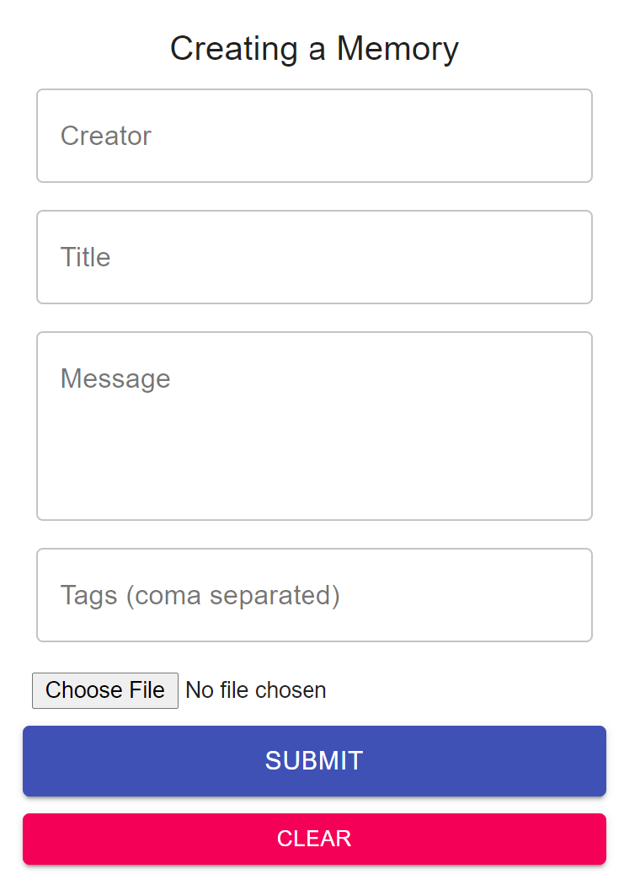
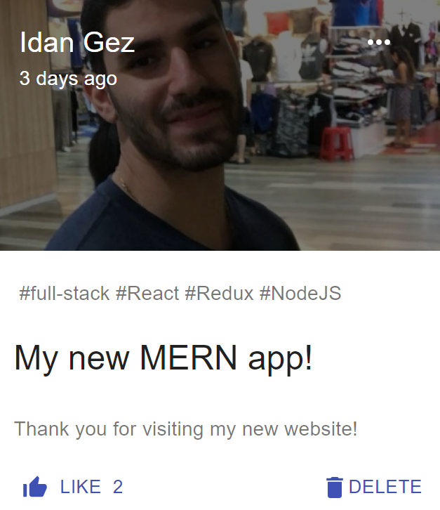

# My First React Project: Memories App

This app allows us to share memories with our friends.

Technologies: React, Redux, NodeJS, express, mongoDB, mongoose, HTML, CSS, Material-UI.

## Form
In the form we fill in the following fields:
Creator, title, message, tags. In addition, there is an option to upload an image.

By clicking the Submit button we will launch these fields and they will become a post.

By clicking on the Clear button, we will clear the form and we can refill it as we wish.

{:width="300px" margin-left="30%"}

## Post

{:width="300px" margin-left="30%"}

### Edit existing post
By clicking on the 3 dots on the top right of the post, the post details will be automatically filled in the form and we can change the form as we wish.
After clicking the Submit button we will get the exact same post with the changes we made.
(The ID of the post will remain the same in the database, the fields we changed will change in the database)

### Like button
We can add likes as we like to the post.

### Delete button
Clicking the Delete button will delete the post immediately from the database so it will no longer appear on the site.